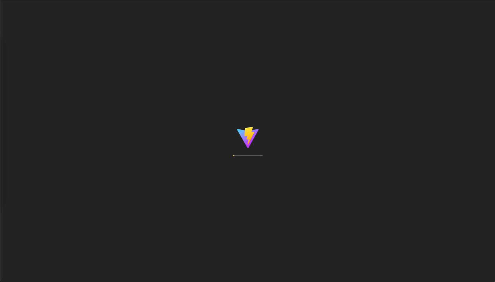

<h1 align='center'>vite-plugin-splash-screen</h1>

<div align="center" >
  &middot;
  <i>Framework-agnostic splash screen plugin for Vite</i>
  &middot;
  <br/>
  <br/>
  
  
  <br/>
  <br/>
</div>



## 💦 Features

When building a Single-Page-Application (SPA) that is fully rendered on the client side (CSR), it is common to only send a minimal HTML file to the client which only defines a single div as the root of the app and includes links and scripts to load all the necessary assets to render the application.

This common approach will lead to a blank screen for a few seconds while the JS is being loaded and parsed. To improve the user experience we can add a splash screen, which are commonly used in mobile applications, that is displayed while the assets are being loaded and parsed. Then when your application is ready and initialized, the splash screen can be animated out of the way to reveal the application.

With `vite-plugin-splash-screen` you get the following:

- **🤹 Framework-agnostic**: Works with any frontend framework that uses Vite!
- **🎨 Customizable**: You can customize the splash screen with your own logo, change colors, and display a loading indicator.
- **🚀 Fast**: The splash screen is inlined to the HTML file at build time.
- **🕹️ Full control**: You can control when the splash screen is hidden.
- **🔮 Easy to use**: Just add the plugin to your Vite config and you are good to go.

## 📲 Installation

Install `vite-plugin-splash-screen` with your favorite package manager:

```sh
npm install -D vite-plugin-splash-screen

# yarn
yarn add -D vite-plugin-splash-screen

# pnpm
pnpm add -D vite-plugin-splash-screen
```

## 🧑‍💻 Usage

Import the plugin and add it to you Vite config.

The only required option is `logoSrc`, which is the path (relative to the [publicDir](https://vitejs.dev/config/shared-options.html#publicdir)) of the logo that will be displayed on the splash screen.

```js
import { splashScreen } from "vite-plugin-splash-screen";

export default defineConfig({
  plugins: [
    /* ...other plugins... */
    splashScreen({
      logoSrc: "logo.svg",
    }),
  ],
});
```

> [!IMPORTANT]  
> **Only SVG logos are supported at the moment so that the logo can be inlined to the HTML file**.
>
> Make sure the logo has appropriate dimensions and is optimized for the web. See [SVGOMG](https://jakearchibald.github.io/svgomg/) for optimizing SVG files.

Then in your application code (written in React, Vue, Svelte, whatever), you can hide the splash screen when the application is ready.

```js
import { hideSplashScreen } from "vite-plugin-splash-screen/runtime";

hideSplashScreen();
```

For example in a React app, you can hide the splash screen in the `useEffect` hook.

```jsx
import { useEffect } from "react";
import { hideSplashScreen } from "vite-plugin-splash-screen/runtime";

export function App() {
  useEffect(() => {
    hideSplashScreen();
  }, []);

  return <div>My App</div>;
}
```

> [!TIP]
> You should wait until your application is fully initialized before hiding the splash screen. This could include setting up a router, initializing a store, loading translations, authenticating the user, or loading data from an API etc.

## 🎨 Customization

You can customize the splash screen by providing additional options to the plugin.

### `minDurationMs`

The minimum duration the splash screen should be displayed, even if the `hideSplashScreen` function has been called.
This is useful to prevent the splash screen from flickering in case the app is initialized very quickly.

For example, to display the splash screen for at least 2 seconds:

```js
splashScreen({
  logoSrc: "logo.svg",
  minDurationMs: 2000,
});
```

### `loaderType`

What type of loading indicator should be displayed below the logo.

Available options: `"line"` (default), `"dots"`, `"none"`.

With `"dots"` you get the following loading indicator:

```js
splashScreen({
  logoSrc: "logo.svg",
  loaderType: "dots",
});
```


Provide `"none"` to hide the loading indicator:

```js
splashScreen({
  logoSrc: "logo.svg",
  loaderType: "none",
});
```


### `loaderBg`

The background color of the loading indicator (default `#0072f5`).

Example:

```js
splashScreen({
  logoSrc: "logo.svg",
  loaderType: "line",
  loaderBg: "#ff0000",
});
```

### `splashBg`

The background color of the splash screen (default `#ffffff`).

Example:

```js
splashScreen({
  logoSrc: "logo.svg",
  splashBg: "#000000",
});
```

### Dynamic colors

If your app supports theming (eg. light and dark mode), you can dynamically change the colors of the splash screen using CSS variables.

The following CSS variables are available:

- `--vpss-bg-splash` - Splash screen background color (default `#ffffff`)
- `--vpss-bg-loader` - Loading indicator background color (default `#0072f5`)

⚠️ Note: in order to avoid flickering of colors you should set the CSS variables **before** the splash screen is rendered! You can easily achieve this by utilizing the [vite-plugin-color-scheme](https://github.com/Temzasse/vite-plugin-color-scheme) plugin to inline a small script to setup the CSS variables based on the user's preferred color scheme.

```js
// vite.config.ts
import { splashScreen } from "vite-plugin-splash-screen";
import { colorScheme } from "vite-plugin-color-scheme";

export default defineConfig({
  plugins: [
    colorScheme({
      defaultScheme: "light",
      variables: {
        light: {
          "--vpss-bg-splash": "#ffffff",
          "--vpss-bg-loader": "#b18500",
        },
        dark: {
          "--vpss-bg-splash": "#242424",
          "--vpss-bg-loader": "#ffcb29",
        },
      },
    }),
    splashScreen({
      /* ...your options... */
    }),
  ],
});
```

## 🛠️ Advanced usage

### Prevent showing splash screen with URL search parameter

In some cases you might want to prevent the splash screen from being displayed,
eg. if you need to manually trigger a page refresh in your application code after
the splash screen has been hidden. For example when the user changes the language
and you need to reload the page to apply the new translations, or when the user
switches workspaces in your application.

In these cases it is probably better to not show the splash screen even though
technically the app is being initialized from scratch again as the user has
already seen the splash screen once.

You can prevent the splash screen from being displayed by adding a URL search
parameter to the URL before reloading the page.

```tsx
const params = new URLSearchParams(location.search);
params.set("vpss", "false");
window.location.search = params.toString();
```

The added search parameter will be automatically removed by the plugin when
the splash screen is initialized after the page reload, so you don't need to
remove it manually yourself.
